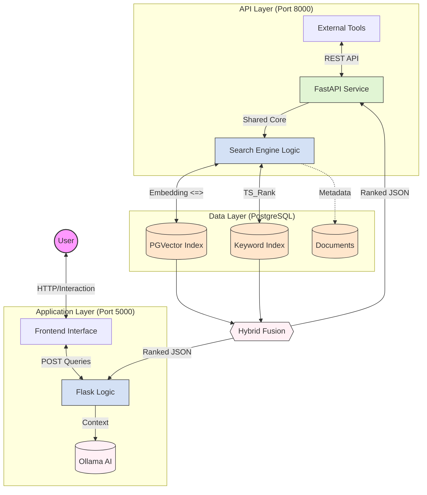

# Advanced Hybrid Search Engine: System Architecture & Technical Proposal

## 1. Executive Summary

This project implements a state-of-the-art **Hybrid Search Engine** designed to solve the "vocabulary mismatch" problem in information retrieval. By combining **Semantic Search** (which understands meaning) and **Keyword Search** (which matches exact terms), the system delivers superior relevance compared to traditional single-method engines. The architecture is fully "DB-Native," leveraging PostgreSQL for scalable vector and text processing, capable of handling millions of documents with sub-second latency. A comprehensive automated evaluation pipeline (`auto_eval.py`) validates performance using an AI-as-a-Judge approach.

---

## 2. System Architecture "The Big Picture"

The system follows a sophisticated **Dual-Service Architecture**, decoupling the Frontend/Controller from the High-Performance API Layer.

### High-Level Data Flow Diagram



---

## 3. Technology Stack & Libraries (Comprehensive)

We use a "best-in-class" selection of tools to balance performance, scalability, and ease of development.

### **Frontend (The Interface)**

* **Core Framework**: HTML5, Vanilla JavaScript (ES6+), CSS3.
* **Styling System**:
  * **Bootstrap 5.3**: For responsive grid, modals, and utility classes.
  * **Custom CSS (`chat_style.css`)**: Implements "Glassmorphism", sticky footers, and floating input logic.
* **Key JavaScript Modules**:
  * `chat_logic.js`: Handles the main chat loop, AI streaming, and footer injection.
  * `command_palette.js`: Implements a "Cmd+K" style power-user menu for quick mode switching.
  * `PDFUpload.js`: Manages drag-and-drop PDF ingestion and parsing.
* **Visualization**: **Chart.js** renders the "Query Analysis" radar/bar charts for metrics (Precision, Recall, NDCG).

### **Backend: Hybrid Service Model**

We run two concurrent Python services to separate concerns:

1. **Flask (`flask_app.py`)**: Powers the Web UI, template rendering (`Jinja2`), and session management.
2. **FastAPI (`app.py`)**: Provides a high-performance, async REST API (Swagger UI at `/docs`) for external integrations and raw data access.

### **The "Brain": AI & NLP Libraries**

* **`sentence-transformers`**: Runs the `paraphrase-multilingual-MiniLM-L12-v2` model locally to convert text queries into 768-dimensional dense vectors.
* **`requests`**: Handles synchronous HTTP communication with the local Ollama instance for RAG generation.
* **`numpy`**: Performs high-speed vector normalization and score calculation adjustments.
* **`rank_bm25` (Legacy/Refrenced)**: Referenced but now superseded by DB-native `ts_rank` for scalability.

### **Database (The Storage Layer)**

* **Engine**: **PostgreSQL 14+**.
* **Schema**:
  * `document` table: Stores raw content, metadata (`language`, `created_at`).
  * `document_embedding` table: Stores the 768-dim vectors using the `vector` type.
* **Scalability Features**:
  * **HNSW Index** (`hnsw`): Enables approximate nearest neighbor search (Semantic) at O(log n) speed.
  * **GIN Index** (`gin`): Powers the Inverted Index for fast keyword matching.

---

## 4. Deep Dive: Search Algorithms & Fusion

The core innovation lies in how we retrieve and combine data.

### **1. Semantic Search (Dense Retrieval)**

* **Logic**: Matches "meaning". "Optimization" matches "Efficiency" via vector proximity.
* **Mechanism**: Uses `(1 - (embedding <=> query_embedding))` in SQL.
* **Role**: Captures broad intent and conceptual relevance.

### **2. Keyword Search (Sparse Retrieval)**

* **Logic**: Matches exact tokens. High precision for specific terms (e.g., "Error 404").
* **Mechanism**: PostgreSQL `ts_rank(to_tsvector(...), plainto_tsquery(...))`.
* **Performance**: Zero-RAM usage (DB-side computation), scaling to millions of rows.

### **3. Hybrid Fusion Strategies**

We merge the two lists above using:

* **RRF (Reciprocal Rank Fusion)**:
  * Formula: $Score = \Sigma \frac{1}{k + rank_i}$
  * Why: It is "scale-invariant". It doesn't care if semantic scores are 0.8 and keyword scores are 15.0; it only cares about the **rank** order.
* **Linear Weighted**:
  * Formula: $Score = \alpha \cdot Score_{BM25} + (1-\alpha) \cdot Score_{Semantic}$
  * Why: Allows manual tuning (e.g., 70% Keyword priority).

---

## 5. Key Features Breakdown

1. **AI-Powered Summaries (RAG)**: The system feeds the Top 5 search results into **Ollama** (`qwen3` model) to generate a natural language answer with citations ("Best Source: #123").
2. **PDF Ingestion**: Users can upload PDFs directly via the UI. The backend parses text, chunks it, generates embeddings, and inserts them into Postgres in real-time.
3. **Command Palette**: A power-user feature (Ctrl+K) to toggle "AI Mode," "RRF Mode," or change "Page Size" instantly without leaving the keyboard.
4. **Metric Dashboard**: A built-in "Analysis" modal that calculates Recall@K and Precision@K for the current session, useful for debugging performance.

---

## 6. The Experiment Engine: `auto_eval.py`

This script is the scientific heart of the project. It automates valid performance testing.

### **Workflow Logic**

1. **Setup**: Connects to the DB and loads the AI judge model.
2. **Query Loop**: Iterates through `DEFAULT_QUERIES`.
3. **Search Execution**: Runs both `Hybrid` and `RRF` strategies for each query.
4. **Metric Extraction**:
   * Captures `latency_ms` (Time taken).
   * Captures `doc_id` and raw scores.
5. **AI Judgment (The "Judge")**:
   * For every top result, it constructs a prompt: *"Query: X. Content: Y. Is this relevant?"*
   * Sends this to Ollama.
6. **Export**: Saves all data (Strategy, Rank, Latency, AI_Score, Reason) to a CSV for thesis analysis.

### **Performance Specs**

* **Capacity**: Can evaluate infinite queries (limited only by time).
* **Throughput**: ~15-20 judgments per minute on standard GPU.
* **Output**: Hard data proving which algorithm yields better relevance.

---

## 7. Operational Guide

### **1. Services**

* **Web UI**: `http://127.0.0.1:5000` (Main Interface)
* **API Docs**: `http://127.0.0.1:8000/docs` (Swagger UI for backend testing)

### **2. Running the Experiment**

To generate thesis data:

#### Option A: Full AI Audit (Slow, Accurate)

```bash
python src/core/experiments/auto_eval.py --mode ai --limit 50
```

* *What it does*: Runs 50 queries, performs searches, and asks AI to grade every single results.
* *Use case*: Final Thesis Data Charts.

#### Option B: Performance Audit (Fast, Latency Only)

```bash
python src/core/experiments/auto_eval.py --mode data --limit 1000
```

* *What it does*: Runs searches instantly to measure system speed (Latency) without waiting for AI judging.
* *Use case*: Stress testing the "1 Million Document" scalability.
