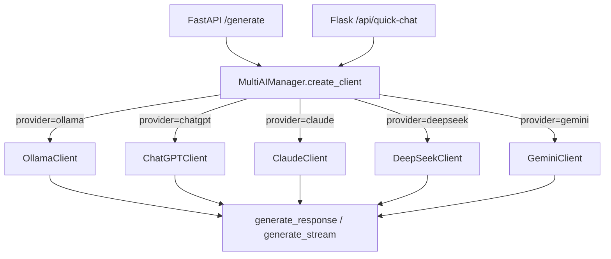

# AI / RAG System

**Folder**: `src/ai/` (6 files)
**Endpoints**: `src/app.py:141-220` (`/generate`, `/generate-stream`)
**Proxies**: `src/flask_app.py:434-510` (`/api/quick-chat`, `/api/quick-chat-stream`)

## Architecture



## Provider Factory

```python
MultiAIManager.create_client(
    provider_name="ollama",  # chatgpt, claude, deepseek, gemini
    api_key="",
    model="qwen2.5:0.5b",
    base_url="http://localhost:11434"
)
```

## All Providers

| Provider Key | Class | Default Model | Default Endpoint | SDK |
|-------------|-------|---------------|------------------|-----|
| `ollama` | `OllamaClient` | `qwen2.5:0.5b` | `http://localhost:11434` | HTTP requests |
| `chatgpt` | `ChatGPTClient` | `gpt-4o` | `https://api.openai.com` | `openai` |
| `claude` | `ClaudeClient` | — | `https://api.anthropic.com` | `anthropic` |
| `deepseek` | `DeepSeekClient` | `deepseek-chat` | `https://api.deepseek.com` | `openai` (compatible) |
| `gemini` | `GeminiClient` | `gemini-2.0-flash` | Google SDK | `google-genai` |

## Abstract Base: `LLMProvider`

| Method | Returns | Description |
|--------|---------|-------------|
| `generate_response(prompt, system_instruction, **kwargs)` | `str` | Full response from AI |
| `generate_stream(prompt, system_instruction, **kwargs)` | Generator | Yields text chunks |
| `generate_rag_response(query, contexts)` | `str` | Builds RAG prompt, calls generate |
| `generate_rag_stream(query, contexts)` | Generator | Streaming RAG |
| `_prepare_rag_prompt(query, contexts)` | `(str, str)` | RAG prompt construction |

## RAG Prompt Structure

```
System: You are an expert Academic Research Assistant.
Critically evaluate the provided Context Sources and synthesize a comprehensive answer.
Use **Markdown** formatting. Cite sources inline using `[Doc ID]`.
Structure:
1. **Synthesis**: Rigorous academic answer identifying key findings
2. **Evaluation**: Concluding paragraph starting with 'In my analysis,'
End with: `BEST_SOURCE_ID: <ID>`

Context Data:
DOC_ID: 123 (Search Rank: 1)
CONTENT: ...

User Question: {query}
```

## API Endpoints

### FastAPI (port 8000)

| Endpoint | Input | Output | Media Type |
|----------|-------|--------|------------|
| `POST /generate` | `{query, contexts, provider, model, api_key, base_url}` | `{answer: string}` | JSON |
| `POST /generate-stream` | Same | Streaming chunks | `text/event-stream` |

### Flask Proxy (port 5000)

| Endpoint | Backend | Notes |
|----------|---------|-------|
| `/generate` | FastAPI `/generate` | Sync proxy |
| `/generate-stream` | FastAPI `/generate-stream` | Chunked proxy |
| `/api/quick-chat` | Direct MultiAIManager | No search context, direct chat |
| `/api/quick-chat-stream` | Direct MultiAIManager | Streaming chat |

## Streaming Implementation

FastAPI uses `StreamingResponse` with a generator function. Flask uses `Response` with `iter_content` from `requests.post(stream=True)`.

```python
# FastAPI
@app.post("/generate-stream")
async def generate_answer_stream(request):
    def stream_logic():
        for chunk in client.generate_rag_stream(query, contexts):
            yield chunk
    return StreamingResponse(stream_logic(), media_type="text/event-stream")

# Flask proxy
@app.route("/generate-stream", methods=["POST"])
def proxy_generate_stream():
    def generate():
        with requests.post(f"{API_URL}/generate-stream", json=data, stream=True) as r:
            for chunk in r.iter_content():
                if chunk:
                    yield chunk
    return Response(generate(), mimetype="text/event-stream")
```

## Temperature Settings

| Use Case | Temperature |
|----------|-------------|
| RAG (factual) | 0.3 |
| Chat (creative) | 0.7 |

## Fallback Logic

If a provider lacks `generate_rag_response()`, the system falls back to:

```python
context_text = "\n".join([f"Doc {c['doc_id']}: {c['content']}" for c in contexts])
answer = client.generate_response(
    prompt=f"Context Data:\n{context_text}\n\nUser Question: {query}",
    system_instruction="You are an Academic Research Assistant."
)
```

## Ollama Client Details

```python
class OllamaClient(LLMProvider):
    def __init__(self, model="qwen2.5:0.5b", base_url="http://localhost:11434"):
        self.api_generate = f"{self.base_url}/api/generate"

    def generate_response(self, prompt, system_instruction="You are a helpful assistant.",
                          temperature=0.7, max_tokens=1000):
        payload = {
            "model": self.model,
            "prompt": f"System: {system_instruction}\n\nUser: {prompt}\n\nAnswer:",
            "stream": False,
            "options": {"temperature": temperature, "num_ctx": 4096, "num_predict": max_tokens}
        }
        response = requests.post(self.api_generate, json=payload, timeout=60)
        return response.json()["response"]
```

## Chat in Analysis Modal

The AI Research Auditor tab (`_ai_auditor.html`) provides:
- Streaming chat with context from current search results
- System prompt includes current metrics (GPA, TP, FP, FN)
- Fallback to UI-only simulated responses if AI unavailable
