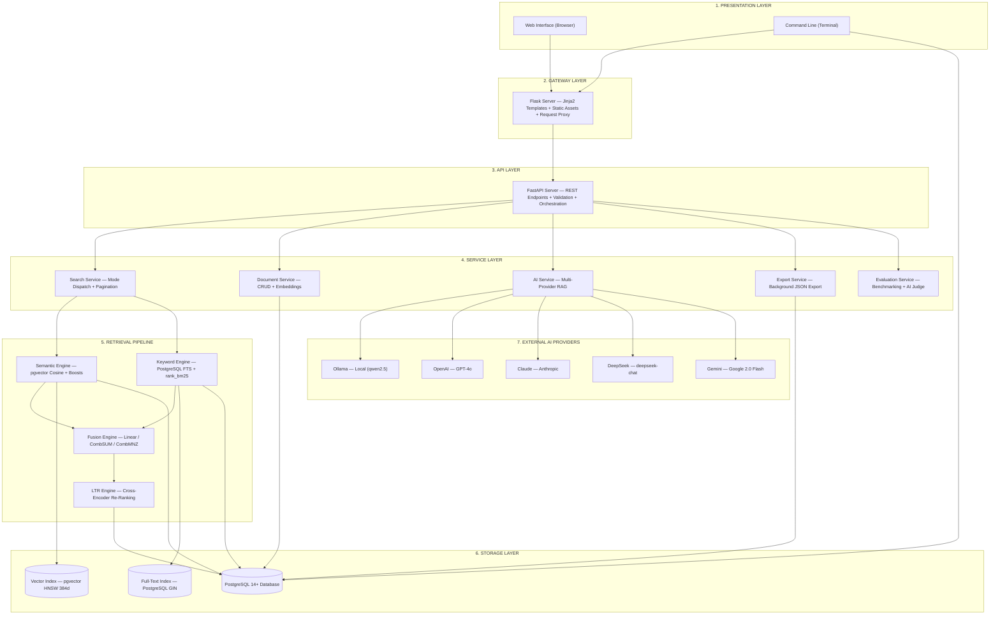
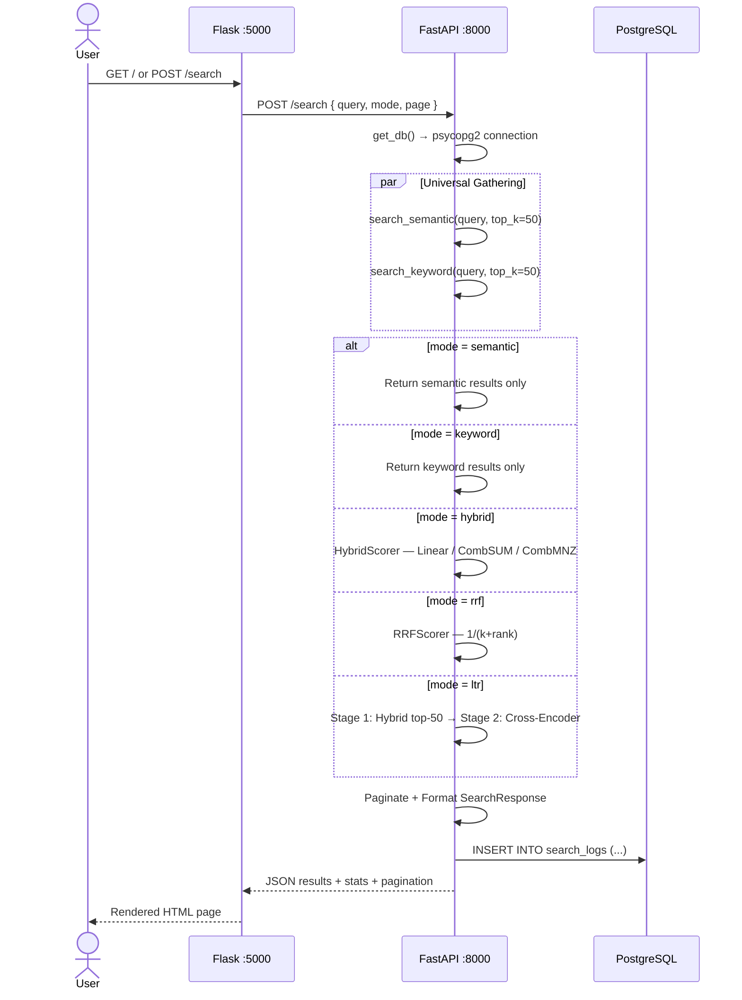
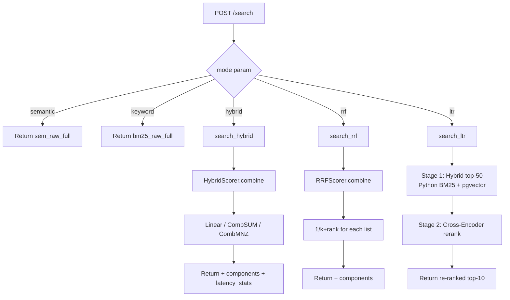
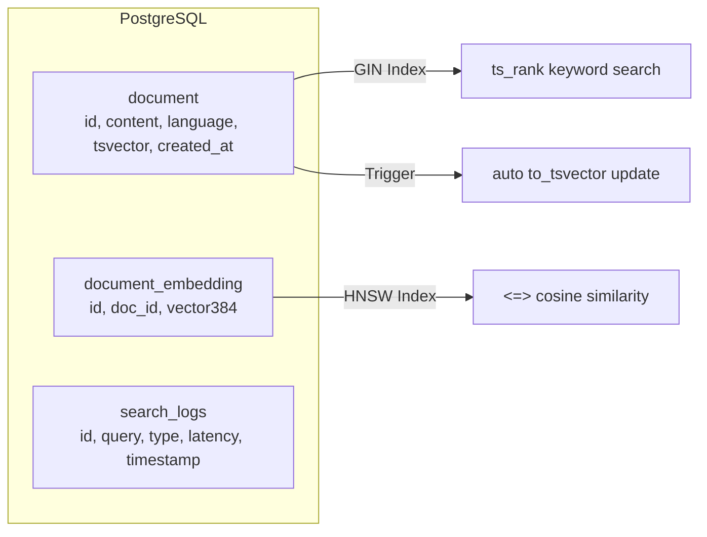

# Architecture

## Layer Diagram

**Figure 3.1: Dual-Path Retrieval Architecture — Seven-Layer System Design**

*The system is decomposed into seven logical layers: Presentation (user interfaces), Gateway (Flask proxy), API (FastAPI endpoints), Services (business logic), Retrieval Pipeline (semantic + keyword search), Storage (PostgreSQL with vector and full-text indexes), and External AI (multi-provider LLM abstraction). Arrows indicate request flow and data dependencies between layers.*

## Layer Explanations

### 1. Presentation Layer
**What it is**: The user-facing interfaces — a web browser and a terminal.

**Web Interface**: Renders the search UI with Bootstrap 5. Handles user input, displays results with rank badges (S:#rank, K:#rank), manages the analysis modal with 8 Chart.js graphs. Communicates with the Gateway via AJAX (SPA mode) or full page POST.

**Command Line**: A 12-command menu-driven interface for power users. Supports document insert, PDF batch upload, all 5 search modes, thesis evaluation, and side-by-side algorithm comparison using Rich tables. Talks directly to the Storage Layer (PostgreSQL) and the API Layer (FastAPI).

**Why separate**: Different users need different interfaces. The web UI is for ad-hoc searching with rich visualization. The CLI is for batch operations and thesis benchmarking.

### 2. Gateway Layer
**What it is**: A Flask server that acts as a reverse proxy between the browser and the API.

**Flask Server**: Receives HTTP requests from the browser, renders Jinja2 templates, serves static files (JS, CSS, images). For search requests, it proxies to FastAPI via `requests.post()`. For document view/edit, it queries PostgreSQL directly (to avoid a round-trip through FastAPI). Also generates matplotlib query-performance graphs as base64-embedded PNGs.

**Why a separate gateway**: Separates UI rendering concerns from pure API logic. Flask handles HTML generation, template inheritance, and static serving; FastAPI handles validation, business logic, and data access. This lets each server be tuned independently — FastAPI can be scaled horizontally while Flask stays as a single entry point.

### 3. API Layer
**What it is**: A FastAPI server that exposes all search, CRUD, AI, export, and system endpoints as a RESTful JSON API.

**FastAPI Server**: Provides 15 endpoints. Validates requests via Pydantic models. Orchestrates the search flow: universal gathering (always fetches both semantic + keyword top-50), mode-specific dispatch, pagination, search logging, and response formatting. Handles PDF uploads with background processing (throttled to 3 concurrent). Manages export tasks with progress polling. Exposes system health and reset operations.

**Why separate**: FastAPI gives us automatic OpenAPI docs (`/docs`), type-validated request/response models, async support for streaming and background tasks, and CORS middleware. By keeping it separate from Flask, we can version the API independently.

### 4. Service Layer
**What it is**: Business logic services that the API layer delegates to. These are Python modules, not separate servers.

**Search Service**: Determines which search mode to run (semantic/keyword/hybrid/rrf/ltr), calls the appropriate retrieval pipeline, formats results with component scores, logs the search, and returns a paginated response.

**Document Service**: Handles insert (content + embedding + FTS vector), delete (cascade to embeddings), and update (re-encode embedding). Called both from the API and from the PDF ingestion pipeline.

**AI Service**: Manages multi-provider LLM access. Builds RAG prompts with retrieved context, dispatches to the correct provider (Ollama, OpenAI, Claude, DeepSeek, Gemini), handles streaming responses.

**Export Service**: Background task that fetches all documents in 500-doc batches, writes to a JSON file with progress tracking.

**Evaluation Service**: Runs 50 predefined queries across 4 strategies, optionally uses an AI judge for relevance assessment, outputs CSV for thesis analysis.

### 5. Retrieval Pipeline
**What it is**: The core search algorithms that convert a query into ranked results. This is where the actual information retrieval happens.

**Semantic Engine**: Encodes the query into a 384-dim vector via SentenceTransformer, searches the pgvector HNSW index using cosine distance (`<=>`), filters by dynamic threshold (0.20-0.35 based on query length), applies position/token/language boosts, and falls back to a lower threshold if no results found.

**Keyword Engine**: Three variants — (1) PostgreSQL `execute_bm25_query` with `'english'` stemming (used by hybrid/rrf), (2) `execute_keyword_query` with `'simple'` config on pre-computed `content_tsvector` (used by keyword mode), (3) Python `rank_bm25` (used by LTR stage 1). All scores are normalized to [0,1] for fusion.

**Fusion Engine**: Takes normalized semantic + BM25 scores and combines them using one of three strategies: Linear weighted (`α·BM + (1-α)·Sem`), CombSUM (additive), or CombMNZ (additive × non-zero count). Returns both the fused rankings and per-doc component scores for frontend analysis.

**LTR Engine**: A two-stage pipeline. Stage 1 retrieves 50 candidates via hybrid search (Python BM25 + pgvector). Stage 2 re-ranks them using a cross-encoder model (`ms-marco-MiniLM-L-6-v2`) that scores each (query, document) pair. This is the most accurate but slowest method (~800ms).

### 6. Storage Layer
**What it is**: A single PostgreSQL 14+ database that holds all data, indexes, and logs.

**PostgreSQL Instance**: Three tables — `document` (text content + tsvector), `document_embedding` (384-dim vectors), `search_logs` (query audit). Two indexes — GIN on `content_tsvector` for fast full-text search, HNSW on `embedding` for approximate nearest-neighbor vector search. One trigger that auto-updates `content_tsvector` on insert/update.

**Why single database**: Eliminates inter-service latency and data synchronization issues. Both tsvector and pgvector live in the same database, connected by foreign key (`document_embedding.doc_id → document.id`).

### 7. External AI Layer
**What it is**: Third-party LLM providers accessed via HTTP APIs.

**Ollama** (default, local): `qwen2.5:0.5b` at `http://localhost:11434`. No API key needed. Used for local, private inference.

**OpenAI**: `gpt-4o` via `api.openai.com`. Requires API key.

**Claude**: Anthropic's API. Requires API key.

**DeepSeek**: `deepseek-chat` via `api.deepseek.com`. OpenAI-compatible SDK.

**Gemini**: `gemini-2.0-flash` via `google-genai` SDK. Requires API key.

**Why multiple providers**: The system is designed for thesis research comparing AI providers. The `MultiAIManager.create_client()` factory normalizes all providers under a single `generate_response()`/`generate_stream()` interface, so switching providers requires only changing the `provider` parameter.

## Component Map

| Layer | Component | File | Role |
|-------|-----------|------|------|
| **Presentation** | Web Interface | `flask_app.py` + templates/ | Renders HTML, serves JS/CSS, AJAX SPA |
| **Presentation** | Command Line | `main.py` | 12-command menu for document/search/eval |
| **Gateway** | Flask Server | `flask_app.py` | Proxies API calls, renders templates, static files |
| **API** | FastAPI Server | `app.py` | 15 REST endpoints, validation, orchestration |
| **Service** | Search Service | `app.py` | Mode dispatch, universal gathering, format |
| **Service** | Document Service | `document_management.py` | Insert, delete, update, re-embed |
| **Service** | AI Service | `app.py` + `ai/` | Multi-provider RAG, streaming chat |
| **Service** | Export Service | `export/core_logic.py` | Background JSON export |
| **Service** | Evaluation | `experiments/auto_eval.py` | 50-query auto-benchmark |
| **Retrieval** | Semantic Engine | `search_flask/semantic_search.py` | Vector cosine + boosts |
| **Retrieval** | Keyword Engine | `search_flask/keyword_search.py` | FTS + rank_bm25 |
| **Retrieval** | Fusion Engine | `HybridScorer.py` | Normalize + 3 strategies |
| **Retrieval** | LTR Engine | `LTRScorer.py` | Cross-encoder rerank |
| **Storage** | PostgreSQL | `db/db_connection.py` | 3 tables, GIN + HNSW indexes |
| **Storage** | Vector Index | pgvector HNSW | 384-dim cosine search |
| **Storage** | FTS Index | PostgreSQL GIN | tsvector keyword search |
| **External** | AI Providers | `ai/` directory | 5 providers via unified interface |

## Request Flow

## 5 Search Modes — Internal Dispatch

## Storage Architecture

## Design Decisions

| Decision | Rationale |
|----------|-----------|
| Flask proxies to FastAPI | UI rendering separated from pure API. Flask handles HTML/templates; FastAPI handles JSON/validation |
| Single PostgreSQL instance | Both tsvector and pgvector in one DB. No cross-service latency, no data sync |
| Universal top_k=50 | Every request fetches both semantic + keyword regardless of selected mode. Enables frontend strategy comparison charts |
| Lazy imports | SentenceTransformer, langchain, unstructured, matplotlib deferred to first use. Server cold start 15s vs 90s |
| Per-query normalization | Score normalization adapts to each query's result distribution. Not global |
| Singleton models | Embedding model (500MB) and cross-encoder loaded once via thread-safe lock |
| Dotenv config | All secrets in .env file, loaded by python-dotenv at both app.py and db_connection.py |
| CORS multi-origin | FastAPI allows localhost:5000, 8080, 8000 for development flexibility |
