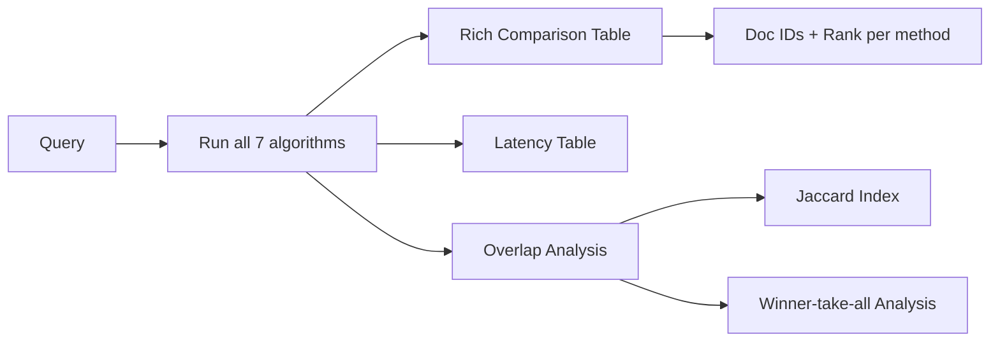

# Evaluation Engine

**Auto-eval**: `src/core/experiments/auto_eval.py` (333 lines)
**Comparator**: `src/core/thesis_comparator.py` (219 lines)
**Notebooks**: `ai_judge.ipynb`, `data_judge.ipynb`
**Data files**: `ai_judge.csv`, `data_judge.csv`

## Auto Evaluation

```
python src/core/experiments/auto_eval.py --mode ai --limit 50
python src/core/experiments/auto_eval.py --mode data --limit 5
```

### Two Modes

| Mode | What it does | Output file |
|------|-------------|-------------|
| `data` | Fast metrics only (latency, scores) | `data_judge.csv` |
| `ai` | Full LLM judge relevance evaluation | `ai_judge.csv` |

### 4 Strategies Evaluated

| Strategy Name | Function | Description |
|--------------|----------|-------------|
| `hybrid_linear` | `search_hybrid(fusion_strategy="linear")` | α=0.5 weighted |
| `rrf` | `search_rrf()` | k=60 rank-based |
| `semantic_only` | `execute_vector_query(threshold=0.0)` | Vector, no threshold |
| `keyword_refined` | `execute_bm25_query()` | PostgreSQL FTS |

### 50 Test Queries

Hardcoded in `DEFAULT_QUERIES` list:

| Category | Count | Example |
|----------|-------|---------|
| Conceptual | 11 | "Explain the attention mechanism in transformers" |
| Factual | 21 | "What is LoRA? Define quantization" |
| Procedural | 13 | "How does fine-tuning reduce training time?" |
| Comparative | 1 | "Compare BERT and GPT architectures" |
| Other | 4 | "What are the ethical concerns of generative AI?" |

### Output CSV Columns

Per row (one per query-document pair):

| Column | Description |
|--------|-------------|
| `timestamp` | ISO datetime |
| `query` | Search query |
| `doc_id` | Document ID |
| `content_preview` | First 60 chars |
| `hybrid_linear_rank` | Rank in hybrid results |
| `hybrid_linear_score` | Score in hybrid results |
| `hybrid_linear_latency` | Hybrid latency in ms |
| `rrf_rank` | Rank in RRF results |
| `rrf_score` | | 
| `rrf_latency` | |
| `semantic_only_rank` | |
| `keyword_refined_rank` | |
| `ai_relevant` | Boolean from LLM judge |
| `ai_score` | Relevance score 0-10 |
| `ai_reason` | Judge explanation |

### AI Judge Prompt

```
Query: {query}
Content fragment: {content[:800]}

Task: Evaluate if the content matches the query.
Return strictly JSON: {"is_relevant": <bool>, "score": <0-10>, "reason": "<text>"}
```

Uses `DeepSeekClient` with temperature=0 for deterministic judgments.

## Thesis Comparator

```
python -c "from core.thesis_comparator import compare_algorithms; compare_algorithms('machine learning')"
```

### 7 Algorithms Compared

| # | Algorithm | Source | Parameters |
|---|-----------|--------|------------|
| 1 | Semantic | `search_semantic(top_k=20)` | Dynamic threshold |
| 2 | Keyword | `search_keyword(top_k=20)` | FTS |
| 3 | Linear | `search_hybrid(linear, top_k=20)` | α=0.5 |
| 4 | CombSUM | `search_hybrid(combsum, top_k=20)` | Additive |
| 5 | CombMNZ | `search_hybrid(combmnz, top_k=20)` | Consensus |
| 6 | RRF | `search_rrf(top_k=20)` | k=60 |
| 7 | LTR | `search_ltr(top_k=20, candidate_k=50)` | Cross-encoder |

### Output



Rich table shows per-document rank across all 7 methods with color coding (green=top-3).

## Frontend Ad-hoc Analysis

Users mark results as **Relevant** via checkboxes, triggering live calculation:

| Metric | Calculation |
|--------|-------------|
| Precision@K | hits / K |
| Recall@K | hits / total_judged_relevant |
| F1 | 2*P*R / (P+R) |
| MAP | Σ precision_at_relevant / total_relevant |
| NDCG@10 | DCG / IDCG (binary relevance) |
| MRR | 1 / rank_of_first_relevant |
| HITS@1/3/5/10 | Binary at each cutoff |
| Jaccard | |sem_ids ∩ key_ids| / |sem_ids ∪ key_ids| |
| Faithfulness | valid_citations / total_citations |
| QpMS | (NDCG / latency) * 1000 |

### Alpha Simulation

Users can drag an `α` slider (0-1) to dynamically re-rank results and see how different fusion weights would change the ranking. NDCG, MAP, F1 update in real-time based on currently judged relevant docs.

### GPA Letter Grade

```
Grade = (NDCG * 0.6) + (MRR * 0.4)
A+ > 0.9 | A > 0.8 | B+ > 0.7 | B > 0.6 | C = rest
```
