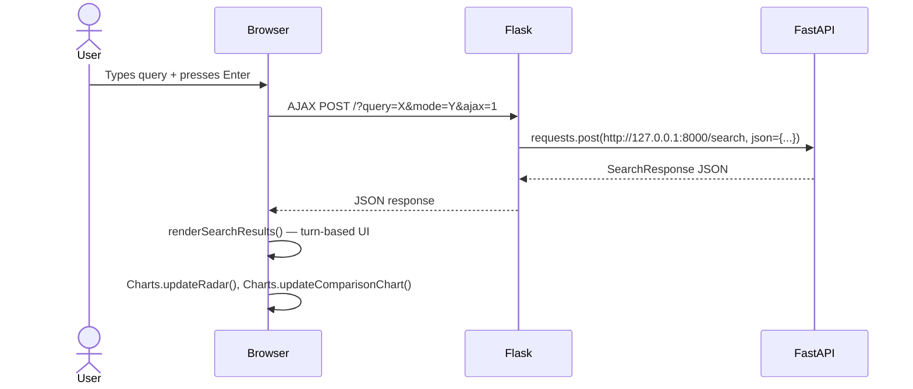

# Flask — Web Frontend

**File**: `src/flask_app.py` (510 lines)
**Port**: 5000
**Architecture**: Reverse proxy to FastAPI + template rendering

## Architecture

Flask does NOT search or compute anything. It:

1. Renders **Jinja2 templates** with Bootstrap 5
2. **Proxies** search/AI requests to FastAPI via `requests.post()`
3. **Direct DB access** for document view/edit (bypasses FastAPI)
4. Generates **matplotlib graphs** as base64 PNG (lazy import)

## All Routes

| Route | Method | Purpose | Proxies to FastAPI? |
|-------|--------|---------|-------------------|
| `/` | GET/POST | Search page + pagination | Yes: `/search` |
| `/document/<id>` | GET | View single document | No: direct SQL |
| `/api/document/<id>` | GET | JSON for modal preview | No: direct SQL |
| `/document/<id>/reembed` | POST | Re-encode embedding | Yes: `/documents/{id}/update` |
| `/document/<id>/update_post` | POST | Update document | Yes: `/documents/{id}/update` |
| `/document/new_post` | POST | Insert document | Yes: `/documents/insert` |
| `/document/<id>/delete_post` | POST | Delete document | Yes: `DELETE /documents/{id}` |
| `/upload-pdf` | POST | Proxy PDF upload | Yes: `/upload-pdf` |
| `/api/stats` | GET | System stats | Yes: `/api/system/stats` |
| `/api/reset` | POST | Reset database | Yes: `/api/system/reset` |
| `/api/stop-indexing` | POST | Stop indexing | Yes: `/api/system/stop-indexing` |
| `/generate` | POST | AI generate proxy | Yes: `/generate` |
| `/generate-stream` | POST | Streaming AI proxy | Yes: `/generate-stream` |
| `/api/quick-chat` | POST | Direct AI chat | No: Direct MultiAIManager |
| `/api/quick-chat-stream` | POST | Streaming AI chat | No: Direct MultiAIManager |

## Template Structure

```
templates/
├── portion/
│   ├── chat_base.html        ← Main layout (sidebar + chat + modals)
│   ├── base.html
│   ├── dashboard_base.html
│   ├── simple_base.html
│   ├── loader.html
│   ├── my_header.html
│   └── confirm_delete.html
│
├── index.html                ← Single page, extends chat_base.html
├── 404.html
│
└── components/
    ├── _search_input.html      # Textarea + search/mode buttons
    ├── _search_results.html    # Result cards with rank badges
    ├── _welcome_screen.html    # Initial empty state
    ├── _telemetry.html         # Query stats display
    ├── _ai_auditor.html        # AI auditor tab (chat + metrics)
    ├── header.html             # Navbar with logo + commands
    ├── header_search.html      # Inline search bar
    ├── sidebar.html            # Collapsible left sidebar
    ├── sidebar_filters.html    # Filter controls in sidebar
    ├── search_form.html        # Full search form
    ├── results_list.html       # Result list partial
    ├── pagination.html         # Page navigation
    ├── modal_analysis.html     # 4-tab analysis dashboard (Charts.js)
    ├── modal_edit.html         # Edit document modal
    ├── modal_create.html       # Create document + PDF upload
    ├── modal_confirm.html      # Confirmation dialog
    ├── delete_modal.html       # Delete confirmation
    ├── setting_modal.html      # Settings (AI pref, LTR toggle)
    ├── command_palette.html    # Ctrl+K command palette
    └── stats_summary.html      # System stats
```

## Static Files (JS)

| File | Size | Purpose |
|------|------|---------|
| `charts.js` | 520 lines | DRY Chart.js factory: 8 chart types + percentage plugin |
| `chat_logic.js` | 1,400 lines | SPA logic, IR metrics engine (NDCG, MAP, MRR), alpha simulator |
| `search_dynamic.js` | 420 lines | Turn-based search UI, benchmark runner |
| `main.js` | 100 lines | Mode selector, form spinner, navbar offset |
| `api_service.js` | 92 lines | Unified fetch wrapper |
| `state_manager.js` | 140 lines | localStorage persistence for AI toggle, mode, LTR |
| `modal_manager.js` | 99 lines | Delete/confirm modal standardized API |
| `sidebar.js` | — | Collapse/expand |
| `url_manager.js` | — | URL ↔ state sync |
| `command_palette.js` | — | Ctrl+K palette |
| `deleteRecord.js` | — | Delete flow |
| `PDFUpload.js` | — | PDF upload UI |
| `ai/assistant.js` | — | AI chat assistant |
| `ai/rag.js` | — | RAG integration |
| `export/logic.js` | — | Export UI |

## Search Flow (SPA)



## JavaScript IR Metrics Engine

When user marks results as **Relevant**:

| Metric | Code | Formula |
|--------|------|---------|
| Precision@K | `IRMetrics.calculate()` | hits / K |
| Recall@K | `IRMetrics.calculate()` | hits / total_relevant |
| F1 | `IRMetrics.calculate()` | 2*P*R / (P+R) |
| MAP | `calculateAndSyncMetrics()` | avg precision at each relevant doc |
| NDCG@10 | `calculateSingleStrategyNDCG()` | DCG / IDCG |
| MRR | `calculateAndSyncMetrics()` | 1 / first_relevant_rank |
| HITS@1/3/5/10 | `calculateAndSyncMetrics()` | binary per cutoff |
| Jaccard | `calculateAndSyncMetrics()` | \|sem ∩ key\| / \|sem ∪ key\| |
| Faithfulness | `calculateAndSyncMetrics()` | valid citation count / total citations |
| QpMS | `updateGPA()` | NDCG / latency * 1000 |

## Analysis Modal (4 Tabs)

| Tab | Contents | Charts |
|-----|----------|--------|
| Doc Analysis | Document fingerprint, score breakdown, content preview | Radar chart |
| Quality Metrics | P@10, R@10, F1, NDCG, confusion matrix, MRR, QpMS, router state | Latency breakdown (stacked bar), Score distribution (histogram), Strategy comparison (horizontal bar) |
| Thesis Re-ranker | PR curve, score correlation, method comparison, winner distribution, elbow curve, GPA | PR curve (line), Correlation (scatter), Method compare (grouped bar), Winner (doughnut), Elbow (line) |
| AI Research Auditor | AI chat for query analysis, bottleneck detection, optimization advice | Simulated audit |

## Graph Generation

`GET /` — generates a matplotlib bar+line chart as base64 PNG:

```python
fig, ax1 = plt.subplots(figsize=(8, 5))
ax1.bar(active_modes, lat_vals, color='#4ecdc4')    # Latency bars
ax2.plot(active_modes, res_vals, 'o-', color='orange') # Result count line
```
