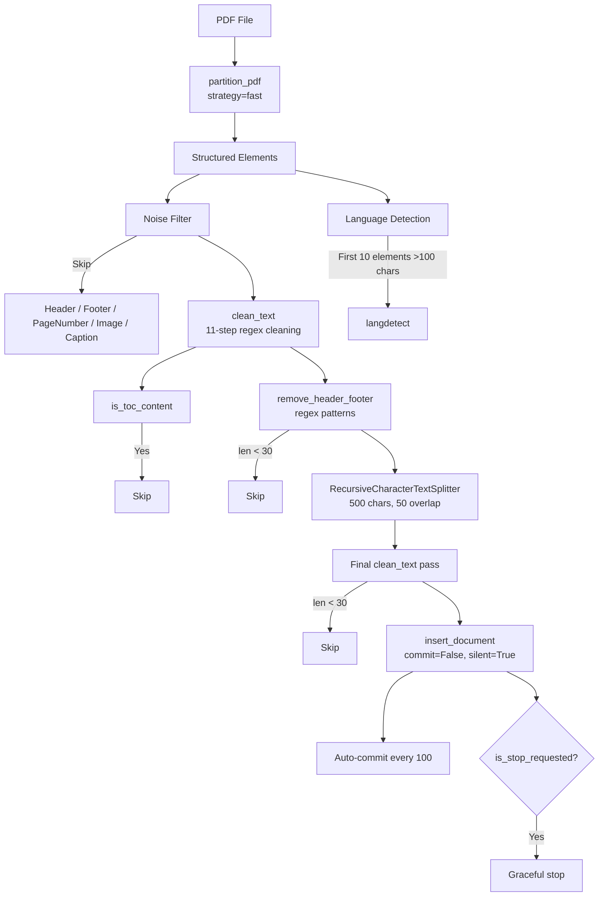

# PDF Ingestion Pipeline

**Files**: `src/core/ingestion/`
- `unstructured_pdf_elements.py` (73 lines) — PDF parser
- `insert_pdf_chunks.py` (175 lines) — Chunking + DB insert
- `bulk_ingest.py` (50 lines) — Directory batch processor

## Full Pipeline



## PDF Parsing

```python
from unstructured.partition.pdf import partition_pdf

elements = partition_pdf(
    filename=pdf_path,
    language=["eng"],
    strategy="fast",              # No OCR
    extract_images=False,
    infer_table_structure=False,
    max_characters=4000,
)
```

Returns list of dicts: `{book_id, book_title, page_number, element_type, raw_text}`

## Noise Categories Skipped

| Category | Reason |
|----------|--------|
| `Header` | Repeated page headers |
| `Footer` | Repeated page footers |
| `PageNumber` | Page numerals |
| `Image` | Non-text content |
| `Caption` | Figure/table captions |

## Text Cleaning (`clean_text`)

11 sequential steps in `src/core/utils/text_properties.py`:

| Step | Action | Regex |
|------|--------|-------|
| 0 | ToC detection | `\.{4,}\s*\d+` or `>60% lines chapter/section + number` |
| 1 | NFKC normalization | `unicodedata.normalize('NFKC', text)` |
| 2 | Remove formatting tags | `\[/?[a-z]+\]` |
| 3 | Fix hyphens | `(\w)-\s*\n\s*(\w)` → `\1\2` |
| 4 | Collapse newlines | `\n+` → space |
| 5 | Remove URLs/emails/handles | `http[s]?://...`, `\b\w+@\w+`, `@\w+`, `#\w+` |
| 6 | Collapse spaces | `[ \t]+` → ` ` |
| 7 | Punctuation | `([!?])\1+` → `\1`, `\.{4,}` → space |
| 8 | PDF artifacts | `\bPage\s+\d+\s*(?:of\s*\d+)?\b`, `\b\d{1,3}\s*/\s*\d{1,3}\b` |
| 9 | Special chars | `\s[^\w\s.,!?;:()\-"]\s` → ` ` |
| 10 | Lowercase + strip | `.strip().lower()` |
| 11 | Sentence spacing | `\.([a-zA-Z])` → `. \1` |

## Chunking

```python
from langchain_text_splitters import RecursiveCharacterTextSplitter

text_splitter = RecursiveCharacterTextSplitter(
    chunk_size=500,
    chunk_overlap=50,
    separators=["\n\n", "\n", ". ", " ", ""],
)
```

## Database Insert

```sql
INSERT INTO document (content, language, content_tsvector)
VALUES (%s, %s, to_tsvector('simple', %s)) RETURNING id;

INSERT INTO document_embedding (doc_id, embedding) VALUES (%s, %s);
```

## Batch Insert Behavior

- `insert_document()` called with `commit=False, silent=True`
- Every 100 successful inserts: `conn.commit()` + progress print
- Every 50 chunks processed: progress print
- Stop flag checked after each chunk: graceful mid-ingestion stop

## Throttling

- FastAPI: `asyncio.Semaphore(3)` — max 3 concurrent PDF ingestions
- Each ingestion runs in a thread pool executor to avoid blocking the event loop

## Stats Summary

```
--- PDF INGESTION SUMMARY ---
  File: paper.pdf
  Inserted: 342
  Noise/ToC Skipped: 15
  Short/Low Quality: 8
  Time: 12.45 seconds
```

## Known Bug

`insert_pdf_chunks.py` line 144 calls `insert_document(..., model, ...)` but **no `model` variable exists** in the file scope. The `model = get_embedder(...)` line was removed. This will crash at runtime.
