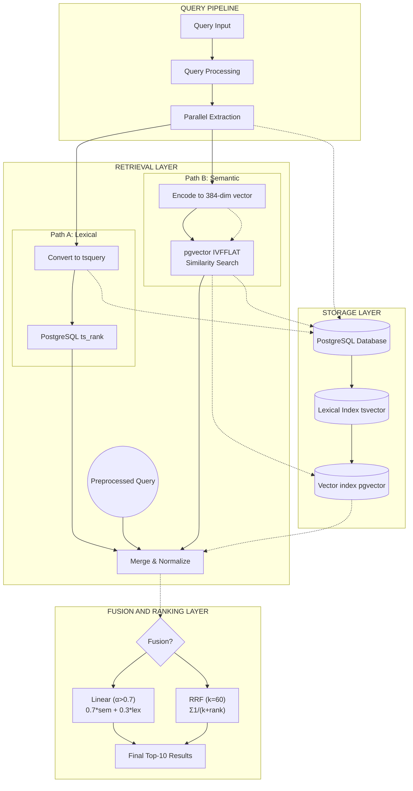

## Pipeline Walkthrough

### 1. Query Pipeline (Top)
Receives raw user input and prepares it for parallel execution.

| Stage | What happens |
|-------|-------------|
| **Query Input** | User types a search query (e.g., "explain attention mechanism") |
| **Query Processing** | Lowercases, strips whitespace, optionally removes stopwords. Normalizes the query for consistent matching in both paths |
| **Parallel Extraction** | The processed query is duplicated and sent simultaneously to both retrieval paths — Lexical (Path A) and Semantic (Path B). They execute in parallel, so total latency = max(A_time, B_time), not A + B |

### 2. Retrieval Layer (Middle)
Two independent retrieval paths that search the same document corpus using different algorithms.

#### Path A: Lexical (Fast — ~70ms)
| Stage | What happens |
|-------|-------------|
| **Convert to tsquery** | Transforms the query into PostgreSQL tsquery format (e.g., `"explain" & "attention" & "mechanism"`) for boolean matching |
| **PostgreSQL ts_rank** | Searches the GIN-indexed `tsvector` column using `@@` operator. Ranks results by `ts_rank()`, which implements BM25-like scoring: term frequency, inverse document frequency, and document length normalization |
| **Output** | Top-100 documents with unbounded ts_rank scores (typically 0–20). These scores are later normalized to [0,1] for fusion |

#### Path B: Semantic (Slow — ~200ms)
| Stage | What happens |
|-------|-------------|
| **Encode to 384-dim vector** | Passes the query through SentenceTransformer (`paraphrase-multilingual-MiniLM-L12-v2`) which outputs a 384-dimensional float vector representing the query's semantic meaning |
| **pgvector IVFFLAT Search** | Searches the HNSW-indexed embedding column using cosine distance (`<=>` operator). IVFFLAT partitions the vector space into 500 clusters for approximate nearest-neighbor search, reducing search from O(n) to O(log n) |
| **Output** | Top-100 documents with cosine similarity scores bounded [0, 1]. Higher = more semantically similar |

#### Merge & Normalize
Combines the results from both paths into a single candidate pool (union of Lexical top-100 and Semantic top-100, typically 150–200 unique documents). Before fusion, scores must be normalized because they're on incomparable scales:
- Lexical ts_rank: unbounded [0, 20+]
- Semantic cosine: bounded [0, 1]

Normalization maps both to [0,1] using per-query min-max scaling. Without this, the unbounded lexical scores would dominate the fusion.

### 3. Storage Layer (Bottom)
A single PostgreSQL 14+ database that stores everything.

| Component | Description |
|-----------|-------------|
| **PostgreSQL Database** | The main database instance. Holds the `document` table (text content, language, tsvector, created_at), `document_embedding` table (doc_id, 384-dim vector), and `search_logs` table |
| **Lexical Index (GIN)** | Built on the `content_tsvector` column. Enables fast keyword matching via the `@@` tsquery operator. Implemented as a GIN (Generalized Inverted Index) |
| **Vector Index (HNSW)** | Built on the `embedding` column. Enables fast approximate nearest-neighbor cosine search. Hierarchical Navigable Small World graph with `m=16` and `ef_construction=64` |

### 4. Fusion & Ranking Layer (Bottom)
Takes the normalized scores from both retrieval paths and combines them into a single ranked list.

| Stage | What happens |
|-------|-------------|
| **Fusion?** | Decision point — which fusion strategy to use (based on the `mode` API parameter) |
| **Linear (α=0.7)** | Weighted combination: `0.7 * semantic + 0.3 * lexical`. The α=0.7 weight favors semantic meaning over keyword matching. This is the default hybrid mode. Formula: `score = α·BM25 + (1-α)·Semantic` |
| **RRF (k=60)** | Reciprocal Rank Fusion: `score = 1/(60 + rank_lexical) + 1/(60 + rank_semantic)`. Rank-based, not score-based. Scale-agnostic — treats a close win the same as a landslide. k=60 is the smoothing constant |
| **Final Top-10 Results** | All candidates sorted by fused score descending. Only the top 10 are returned to the user. The full candidate list (`rank_debug`) is also returned for frontend strategy comparison charts |

### Key Design Properties

| Property | How it works |
|----------|-------------|
| **Parallel execution** | Path A and Path B run simultaneously. Total retrieval latency = max(~70ms, ~200ms) = ~200ms. Sequential would be ~270ms → 26% savings |
| **Score normalization is critical** | Without it, unbounded ts_rank (0-20) would dominate bounded cosine (0-1). Min-max normalization per query ensures fair signal combination |
| **Fusion strategy matters** | Linear preserves score magnitude (a close semantic match still contributes even if lexical misses). RRF is rank-only (scale-agnostic) but discards confidence information |
| **Single database for both indexes** | Both GIN and HNSW indexes live in the same PostgreSQL instance. No data sync, no inter-service latency, simpler operations |

