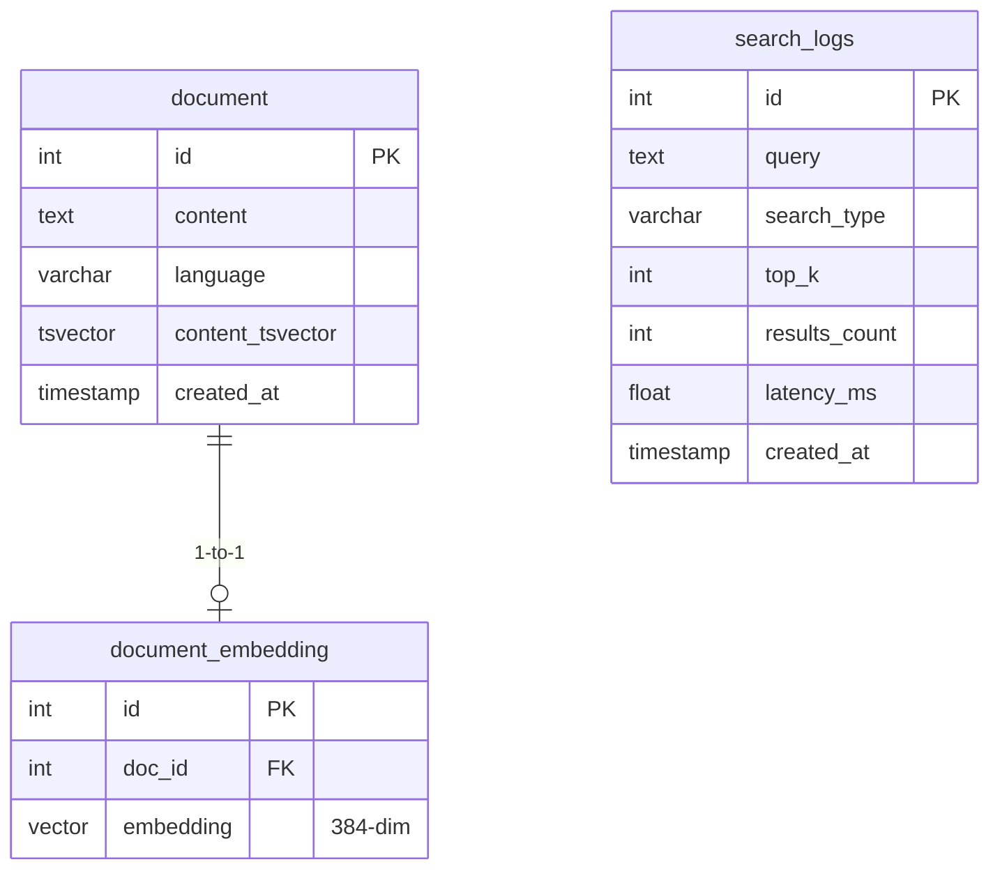
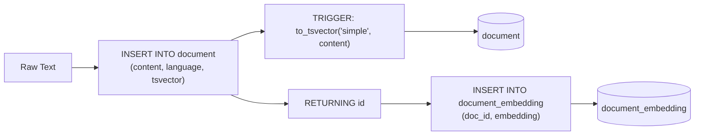

# Database Schema

**Connection**: `src/core/db/db_connection.py` — `psycopg2.connect()` via env vars
**DDL**: `queries.sql` — table creation, indexes, triggers

## Entity Relationship



## Tables

### `document`

| Column | Type | Constraints | Default | Description |
|--------|------|-------------|---------|-------------|
| `id` | `SERIAL` | `PRIMARY KEY` | Auto | Document identifier |
| `content` | `TEXT` | `NOT NULL` | — | Raw document text |
| `language` | `VARCHAR(10)` | | `'en'` | Detected language code |
| `content_tsvector` | `TSVECTOR` | | — | Pre-computed FTS vector |
| `created_at` | `TIMESTAMP` | | `NOW()` | Insertion time |

### `document_embedding`

| Column | Type | Constraints | Default | Description |
|--------|------|-------------|---------|-------------|
| `id` | `SERIAL` | `PRIMARY KEY` | Auto | Row identifier |
| `doc_id` | `INTEGER` | `REFERENCES document(id) ON DELETE CASCADE` | — | Foreign key |
| `embedding` | `VECTOR(384)` | | — | SentenceTransformer embedding |

### `search_logs`

| Column | Type | Constraints | Default | Description |
|--------|------|-------------|---------|-------------|
| `id` | `SERIAL` | `PRIMARY KEY` | Auto | Log identifier |
| `query` | `TEXT` | `NOT NULL` | — | Raw query text |
| `search_type` | `VARCHAR(20)` | `NOT NULL` | — | semantic, keyword, hybrid, rrf, ltr |
| `top_k` | `INT` | | `0` | Requested page size |
| `results_count` | `INT` | | `0` | Returned result count |
| `latency_ms` | `DOUBLE PRECISION` | | `0` | Wall-clock query time (ms) |
| `created_at` | `TIMESTAMP` | | `NOW()` | Search timestamp |

## Indexes

### GIN Index (Full-Text Search)

```sql
CREATE INDEX idx_document_content_tsvector
    ON document USING GIN (content_tsvector);
```

Enables fast `tsvector @@ tsquery` matching. Without this, keyword search would be a full table scan.

### HNSW Index (Vector Search)

```sql
CREATE INDEX ON document_embedding
    USING hnsw (embedding vector_cosine_ops);
```

Enables approximate nearest neighbor cosine search. Parameters:
- `m = 16` — max number of connections per node
- `ef_construction = 64` — search width during construction (higher = better recall, slower build)

Without this, vector search would be O(n) scan.

## Trigger: Auto-Update tsvector

```sql
CREATE OR REPLACE FUNCTION update_tsvector_column()
RETURNS TRIGGER AS $$
BEGIN
    NEW.content_tsvector := to_tsvector('simple', NEW.content);
    RETURN NEW;
END;
$$ LANGUAGE plpgsql;

CREATE TRIGGER trigger_update_tsvector
    BEFORE INSERT OR UPDATE OF content ON document
    FOR EACH ROW
    EXECUTE FUNCTION update_tsvector_column();
```

Uses `'simple'` configuration (no stemming) to preserve exact word forms.

## Insert Sequence



## Search Queries

### Semantic (pgvector)

```sql
SELECT d.id, d.content,
       (1 - (e.embedding <=> %s::vector)) AS similarity,
       d.language, d.created_at
FROM document d
INNER JOIN document_embedding e ON d.id = e.doc_id
WHERE (1 - (e.embedding <=> %s::vector)) >= %s
ORDER BY similarity DESC
LIMIT %s;
```

### Keyword — variant 1 (pre-computed, simple config)

```sql
SELECT id, content,
       ts_rank(content_tsvector, plainto_tsquery('simple', %s)) AS score,
       language, created_at::text
FROM document
WHERE content_tsvector @@ plainto_tsquery('simple', %s)
ORDER BY score DESC LIMIT %s;
```

### Keyword — variant 2 (on-the-fly, english config)

```sql
SELECT d.id, d.content,
       ts_rank(to_tsvector('english', d.content), plainto_tsquery('english', %s)) AS rank,
       d.language, d.created_at
FROM document d
WHERE to_tsvector('english', d.content) @@ plainto_tsquery('english', %s)
ORDER BY rank DESC LIMIT %s;
```

## Search Log Query

```sql
INSERT INTO search_logs (query, search_type, top_k, results_count, latency_ms)
VALUES (%s, %s, %s, %s, %s);
```

## Reset

```sql
TRUNCATE TABLE document_embedding, document, search_logs RESTART IDENTITY CASCADE;
```

## Config

```env
DB_HOST=localhost
DB_PORT=5432
DB_NAME=hybrid_search
DB_USER=postgres
DB_PASSWORD=your_password
```

Connection via `psycopg2.connect()` using these env vars.
