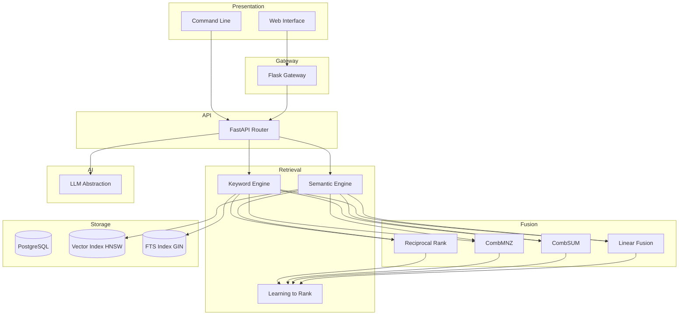
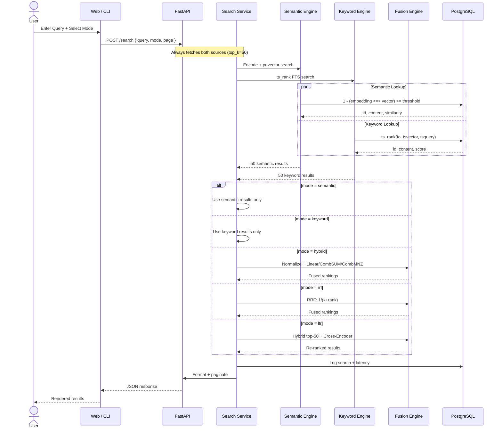
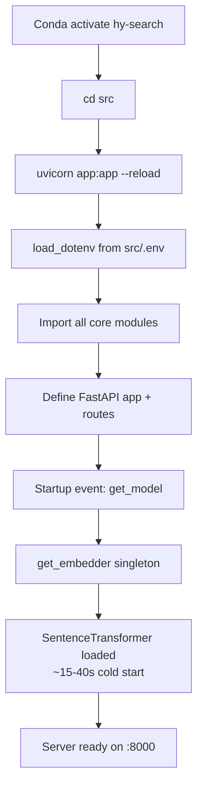

# Hybrid Search — Project Brain

## What Is This?

A document retrieval system that combines **semantic (vector)** search with **keyword (BM25)** search. Built for a Master's thesis studying quality-latency trade-offs in RAG-based educational chatbots. Processes 50,000+ document chunks from arXiv AI publications across 5 search modes and 3 fusion strategies.

**Thesis**: *Optimizing Hybrid Retrieval for RAG-Based AI Educational Assistants: An Empirical Study of Quality-Latency Trade-Offs on Technical Research Corpora*

**Author**: Abdul Saboor Hamedi — Universitas Pamulang, 2026

## System Overview

```
User Input → Flask Gateway → FastAPI Router → Retrieval Layer → Fusion Engine → Ranked Results
                 ↓                              ↓
           Jinja2 Templates              PostgreSQL + pgvector
           Bootstrap 5 UI                384-dim embeddings
           Chart.js analytics            GIN + HNSW indexes
```

### Entry Points

| Interface | File | Port | Purpose |
|-----------|------|------|---------|
| Web UI | `src/flask_app.py` | 5000 | Search page, result rendering, AJAX SPA |
| REST API | `src/app.py` | 8000 | All search, CRUD, AI, export, system endpoints |
| CLI | `src/main.py` | — | Document management, search, evaluation, benchmarking |

## Repository Map

```
hybrid_search/
│
├── src/
│   ├── app.py                         # FastAPI — 15 endpoints, 730 lines
│   ├── flask_app.py                   # Flask — 22 routes, Jinja2 proxy
│   ├── main.py                        # CLI — 12 commands, Rich UI
│   ├── .env                           # DB_HOST, DB_PORT, DB_NAME, etc.
│   │
│   ├── core/
│   │   ├── __init__.py
│   │   │
│   │   ├── db/
│   │   │   ├── __init__.py
│   │   │   ├── db_connection.py       # psycopg2 + pgvector + dotenv
│   │   │   │
│   │   │   ├── algorithms/
│   │   │   │   ├── BM25Search.py      # rank_bm25 wrapper (k1=1.5, b=0.75)
│   │   │   │   └── RRFScores.py       # RRF scorer (has dead process_list code)
│   │   │   │
│   │   │   └── operations/
│   │   │       ├── search_queries.py      # execute_vector_query + execute_bm25_query
│   │   │       ├── keyword_queries.py     # execute_keyword_query + normalize
│   │   │       ├── db_controller.py       # update_record()
│   │   │       ├── document_management.py # insert_document() + delete_document()
│   │   │       │
│   │   │       ├── search_cli/
│   │   │       │   └── count_document.py  # get_document_count()
│   │   │       │
│   │   │       └── search_flask/
│   │   │           ├── semantic_search.py  # Vector cosine + boosts
│   │   │           ├── keyword_search.py   # FTS wrapper
│   │   │           ├── hybrid_search.py    # Orchestrator + fusion dispatch
│   │   │           ├── rrf_search.py       # Reciprocal Rank Fusion
│   │   │           ├── ltr_search.py       # 2-stage hybrid + cross-encoder
│   │   │           ├── HybridScorer.py     # Normalize + Linear/CombSUM/CombMNZ
│   │   │           └── LTRScorer.py        # Cross-encoder singleton (ms-marco-MiniLM)
│   │   │
│   │   ├── models/
│   │   │   ├── __init__.py
│   │   │   └── ai_model.py            # get_embedder() singleton
│   │   │
│   │   ├── frontend/
│   │   │   ├── templates/
│   │   │   │   ├── index.html              # Extends chat_base.html
│   │   │   │   ├── 404.html
│   │   │   │   ├── components/             # 20 reusable Jinja2 partials
│   │   │   │   │   ├── _search_input.html    # Textarea + submit
│   │   │   │   │   ├── _search_results.html  # Result list with rank badges
│   │   │   │   │   ├── _welcome_screen.html  # Initial empty state
│   │   │   │   │   ├── _telemetry.html       # Query stats
│   │   │   │   │   ├── _ai_auditor.html      # AI audit tab content
│   │   │   │   │   ├── header.html
│   │   │   │   │   ├── header_search.html
│   │   │   │   │   ├── sidebar.html
│   │   │   │   │   ├── sidebar_filters.html
│   │   │   │   │   ├── search_form.html
│   │   │   │   │   ├── results_list.html
│   │   │   │   │   ├── pagination.html
│   │   │   │   │   ├── modal_analysis.html   # 4-tab analysis dashboard
│   │   │   │   │   ├── modal_edit.html
│   │   │   │   │   ├── modal_create.html
│   │   │   │   │   ├── modal_confirm.html
│   │   │   │   │   ├── delete_modal.html
│   │   │   │   │   ├── setting_modal.html
│   │   │   │   │   ├── command_palette.html
│   │   │   │   │   └── stats_summary.html
│   │   │   │   └── portion/                # 7 base templates
│   │   │   │       ├── chat_base.html        # Main layout (sidebar + chat)
│   │   │   │       ├── base.html
│   │   │   │       ├── dashboard_base.html
│   │   │   │       ├── simple_base.html
│   │   │   │       ├── loader.html
│   │   │   │       ├── my_header.html
│   │   │   │       └── confirm_delete.html
│   │   │   │
│   │   │   └── static/
│   │   │       ├── css/
│   │   │       │   ├── style.css            # 521 lines — main app styling
│   │   │       │   ├── chat_style.css
│   │   │       │   ├── dashboard.css
│   │   │       │   └── modal_analysis.css   # 275 lines — dark dashboard theme
│   │   │       │
│   │   │       ├── js/
│   │   │       ├── charts.js               # 520 lines — 8 chart types, plugin, DRY
│   │   │       ├── chat_logic.js           # 1400 lines — UI logic, IR metrics
│   │   │       ├── search_dynamic.js       # SPA search, benchmark runner
│   │   │       ├── main.js                 # Mode selector, form spinner
│   │   │       ├── api_service.js          # Fetch wrapper
│   │   │       ├── state_manager.js        # localStorage persistence
│   │   │       ├── sidebar.js
│   │   │       ├── url_manager.js
│   │   │       ├── modal_manager.js
│   │   │       ├── deleteRecord.js
│   │   │       ├── command_palette.js
│   │   │       ├── PDFUpload.js
│   │   │       ├── ai/assistant.js
│   │   │       ├── ai/rag.js
│   │   │       └── export/logic.js
│   │   │
│   │   └── graphs/
│   │       └── analyze.py              # matplotlib → base64 PNG
│   │
│   ├── ingestion/
│   │   ├── insert_pdf_chunks.py        # PDF pipeline (has missing model bug)
│   │   ├── unstructured_pdf_elements.py # partition_pdf wrapper
│   │   └── bulk_ingest.py              # Directory batch processor
│   │
│   ├── export/
│   │   ├── core_logic.py               # Background JSON export (500/batch)
│   │   └── cli.py                      # CLI export interface
│   │
│   ├── experiments/
│   │   ├── auto_eval.py                # 50 queries, 4 strategies, CSV output
│   │   ├── data_judge.py               # Fast metrics-only variant
│   │   ├── ai_data.py
│   │   ├── ai_judge.ipynb              # Jupyter analysis notebook
│   │   └── data_judge.ipynb            # Jupyter analysis notebook
│   │
│   └── utils/
│       ├── __init__.py
│       ├── text_properties.py          # clean_text, normalize, ToC detect, fragments
│       ├── text_cleansing.py           # LangChain PyPDFLoader wrapper
│       ├── bm25_utils.py               # Global rank_bm25 cache with needs_update flag
│       ├── languages.py                # langdetect wrapper
│       ├── system_state.py             # Global stop_requested flag
│       ├── helper_functions.py         # measure_time, check_if_empty, go_back
│       ├── ColorScheme.py              # ANSI terminal color codes
│       ├── rich_console.py             # Rich table + paragraph display
│       ├── console_stats.py            # CLI search stats printer
│       ├── menu.py                     # MENU dict + safe_input helpers
│       ├── warmp.py                    # Model pre-download script
│       ├── export_onnx.py              # ONNX export script
│       └── arxiv_downloader.py         # arXiv API data fetcher
│
│   └── ai/
│       ├── __init__.py
│       ├── MultiAIManager.py           # Factory: create_client()
│       ├── LLMProvider.py              # Abstract base: generate, stream, RAG
│       ├── OllamaClient.py             # qwen2.5:0.5b, localhost:11434
│       ├── ChatGPTClient.py            # gpt-4o, api.openai.com
│       ├── ClaudeClient.py             # api.anthropic.com
│       ├── DeepSeekClient.py           # deepseek-chat, api.deepseek.com
│       └── GeminiClient.py             # gemini-2.0-flash, Google SDK
│
├── brain/                              # This documentation
├── requirements.txt                    # 27 packages
├── README.md                           # User-facing docs
├── talk.md                             # Running notes / errors
├── journals.md                         # Thesis proposal (Indonesian + English)
├── queries.sql                         # DDL + indexes + triggers
├── test.py
└── .gitignore
```

## Deploy Command Cheatsheet

```bash
# Activate
conda activate hy-search

# FastAPI backend
cd src
uvicorn app:app --reload --port 8000

# Flask frontend (separate terminal)
cd src
python flask_app.py

# CLI
cd src
python main.py
```

## Project Stats

| Metric | Value |
|--------|-------|
| Python files | 56 |
| Frontend JS | 14 files |
| CSS | 4 files |
| HTML templates | 28 files |
| Brain docs | 16 markdown files |
| Total Python lines | ~8,500 |
| Total JS lines | ~4,500 |

## Architecture Overview



## Data Flow: Search Request



## All 5 Search Modes

| Mode | Technique | Formula | Score Range | Retrieval Method | Fusion | Re-rank |
|------|-----------|---------|-------------|-----------------|--------|---------|
| **semantic** | Vector cosine | `1 - (embedding <=> vector)` | [0, 1] | pgvector HNSW | None | None |
| **keyword** | Full-text FTS | `ts_rank(tsvector, tsquery)` | [0, ∞] → [0,1] | PostgreSQL GIN | None | None |
| **hybrid-linear** | Weighted sum | `α·BM25 + (1-α)·Sem` | [0, 1] | pgvector + FTS | Linear | None |
| **hybrid-combsum** | Additive | `Sem + BM25` | [0, 2] | pgvector + FTS | CombSUM | None |
| **hybrid-combmnz** | Consensus | `(Sem+BM25)·count_nonzero` | [0, 4] | pgvector + FTS | CombMNZ | None |
| **rrf** | Rank-based | `1/(k+rank_sem) + 1/(k+rank_bm25)` | [0, 0.033] | pgvector + FTS | RRF | None |
| **ltr** | 2-stage | Hybrid → Cross-Encoder scores | [-∞, +∞] | pgvector + BM25 | Linear (α=0.5) | Cross-Encoder |

## Environment Variables

| Variable | Default | Where Used | Purpose |
|----------|---------|-----------|---------|
| `DB_HOST` | — | `db_connection.py` | PostgreSQL host |
| `DB_PORT` | — | `db_connection.py` | PostgreSQL port |
| `DB_NAME` | — | `db_connection.py` | Database name |
| `DB_USER` | — | `db_connection.py` | Database user |
| `DB_PASSWORD` | — | `db_connection.py` | Database password |
| `EMBEDDER_MODEL` | `paraphrase-multilingual-MiniLM-L12-v2` | `db_connection.py:get_model()` | SentenceTransformer model name |
| `BASE_THRESHOLD` | `0.15` (hybrid) / `0.35` (semantic) | `semantic_search.py`, `hybrid_search.py` | Cosine similarity minimum |
| `TOP_K` | `10` | All search files | Max results per query |
| `BM25_WEIGHT` / `SEMANTIC_WEIGHT` | `0.5` | `hybrid_search.py` | Linear fusion α |
| `HYBRID_BM25_NORM` | `max` | `keyword_queries.py`, `HybridScorer.py` | Normalization: max/log/minmax |
| `MAX_CANDIDATES` | `10` | `app.py` | LTR candidate pool size |
| `DEBUG_QUERY` | — | `hybrid_search.py` | Debug print for exact query match |

## Configuration Sources (Priority Order)

1. **Request body** — highest priority (API call parameters)
2. **Environment variables** — medium priority (.env file)
3. **Source defaults** — lowest priority (hardcoded in Python)

## Startup Sequence



## Known Code Issues

| # | Severity | File | Line | Description |
|---|----------|------|------|-------------|
| 1 | HIGH | `core/ingestion/insert_pdf_chunks.py` | 144 | `insert_document()` called with `model` but no `model` variable exists. Will crash at runtime. |
| 2 | LOW | `core/db/algorithms/RRFScores.py` | 43-74 | `process_list()` helper is defined but never called. Dead code. |
| 3 | LOW | `core/frontend/graphs/analyze.py` | 9-76 | Entire `generate_comparison_graph()` is commented out. Dead code. |
| 4 | LOW | `src/app.py` | 290,293 | `paginated = all_results[offset : offset + page_size]` duplicated. |

## Key Architectural Decisions

| Decision | Rationale |
|----------|-----------|
| Single PostgreSQL for both index types | Eliminates inter-service latency, one connection pool |
| Flask → FastAPI proxy pattern | Separation of UI rendering from API logic |
| Always fetch both sem + keyword (top_k=50) | Enables frontend strategy comparison without extra queries |
| Lazy heavy imports | Server starts in ~15s instead of ~90s by deferring SentenceTransformer, langchain, matplotlib |
| Singleton embedding model | 500MB+ model loaded once, thread-safe |
| Python BM25 for LTR (not PostgreSQL) | LTR needs per-query BM25 scores, not pre-computed ts_rank |
| Dotenv configuration | No hardcoded secrets, environment-specific setup |
| score normalization per-query | Adapts to varying score distributions across queries |

## Tech Stack

| Category | Technology | Purpose |
|----------|-----------|---------|
| **Backend** | Python 3.13, FastAPI 0.115, Flask 3.1 | REST API + web server |
| **Database** | PostgreSQL 14+, pgvector 0.7 | Document + vector storage |
| **Embedding** | sentence-transformers 5.6.1 | 384-dim multilingual embeddings |
| **Re-ranking** | Cross-Encoder ms-marco-MiniLM-L-6-v2 | Learning-to-Rank |
| **BM25** | rank-bm25 0.2 | Python BM25Okapi |
| **PDF** | unstructured 0.18, pdfplumber 0.11 | Document extraction |
| **Chunking** | langchain-text-splitters 0.3 | RecursiveCharacter splitting |
| **AI** | Ollama, OpenAI, Claude, DeepSeek, Gemini | RAG generation |
| **Frontend** | Bootstrap 5, Chart.js 4, marked.js | Visualization |
| **CLI** | Rich 14.2, console 0.99 | Terminal UI |
| **Config** | python-dotenv 1.2 | Environment management |
